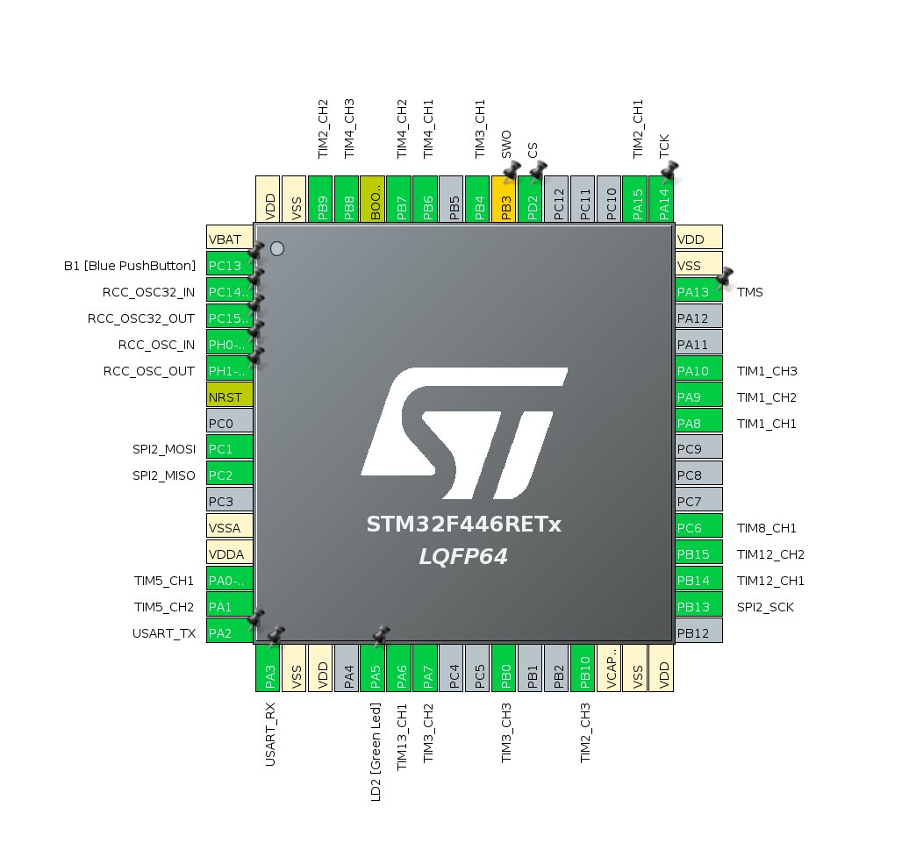
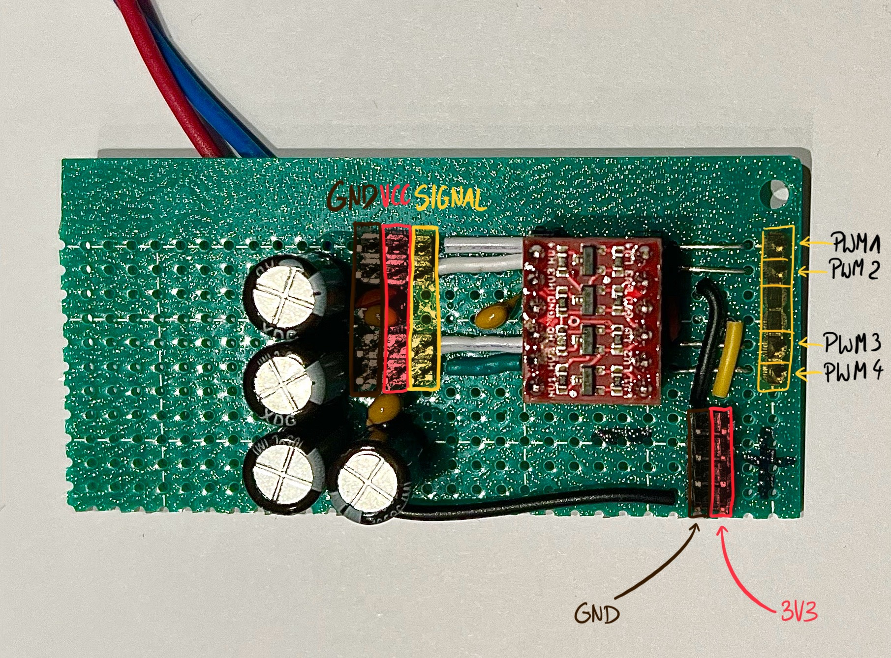
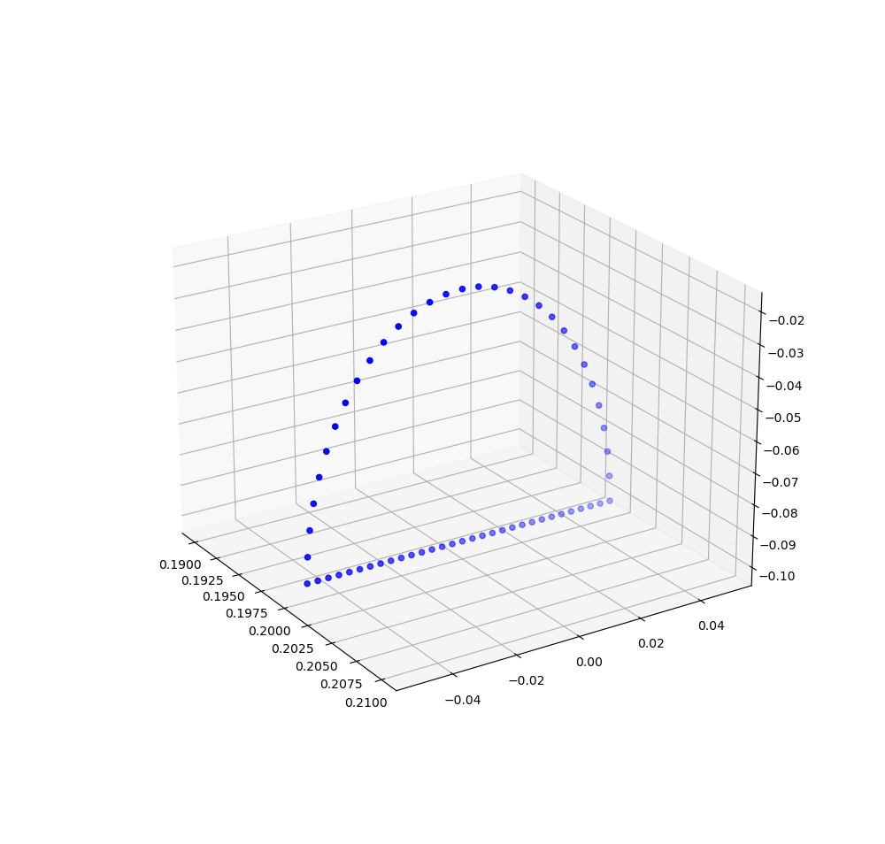

# Integration guide
## Integration information
All integration tests are conducted on either *main elkapod controller* or *secondary elkapod controller*. Each controller is a Raspberry Pi 4B with 4 GB of RAM memory.
Here are the some information for each of them:
### Main Elkapod Controller
- Hostname: `hexapod.local`
- OS: `Ubuntu Server 22.04 LTS`
- Main account: `hexapod`
- MAC address dla interfejsu `wlan0`: `dc:a6:32:76:50:41`
- MAC address dla interfejsu `eth0`: `dc:a6:32:76:50:40`

### Secondary Elkapod Controller
- Hostname: `hexapodsec.local`
- OS: `Ubuntu Desktop 22.04 LTS`
- Main account: `hexapod-sec`
- MAC address dla interfejsu `wlan0`: `dc:a6:32:7d:42:d5`
- MAC address dla interfejsu `eth0`: `dc:a6:32:7d:42:d4`

For passwords contact Piotr Patek.
### RPi side connections
On the RPi side a total number of 5 pins will be utilized. 4 of them for the SPI connectivity purpouse and 1 - `GND` for obvious electonic reasons. Hexapod Protocol Driver uses `SPI0` on the RPi side so following pins will be used:
| Connection name | GPIO PIN                    | HEADER PIN NUMBER 
|-----------------|-----------------------------|------------------
| MOSI            | GPIO 10                     | 19
| MISO            | GPIO 9                      | 21
| SCK             | GPIO 11                     | 23
| NCS             | GPIO 8                      | 24

As metioned before one has to choose any `GND` pin and connect it to Hardware Controller board!

Pinout for Raspberry Pi 4B is presented below


### Hardware Controller connections
If the STM32F446RE is used the following pins are utilized for SPI connectivity:
More info about Hardware Controller Software [here](https://github.com/HexapodBionik/Hardware_Controller) on `main` branch

| Connection name | STM32F446 Port & Pin number |
|-----------------|-----------------------------|
| MOSI            | PC1                         |
| MISO            | PC2                         |
| SCK             | PB13                        |
| NCS             | PD2                         |

Additionally, PWM signals are provided on those outputs:

| Leg ID | Servo ID | STM32F446 Port & Pin number |
| ------ | -------- | --------------------------- |
| 1      | 11       | PA8                         |
| 1      | 12       | PA9                         |
| 1      | 13       | PA10                        |
| 2      | 21       | PA15                        |
| 2      | 22       | PB9                         |
| 2      | 23       | PB10                        |
| 3      | 31       | PB4                         |
| 3      | 32       | PA7                         |
| 3      | 33       | PB0                         |
| 4      | 41       | PB6                         |
| 4      | 42       | PB7                         |
| 4      | 43       | PB8                         |
| 5      | 51       | PA0                         |
| 5      | 52       | PA1                         |
| 5      | 53       | PC6                         |
| 6      | 61       | PB14                        |
| 6      | 62       | PB15                        |
| 6      | 63       | PA6                         |

Complete pinout of Hexapod Controller based on STM32F446 is provided below:



STM32L476RG - to be added soon

### Temporary connector board
Servomotors `PWM signals` as well as `3V3` and `GND` from Hardware Controller should be connected to the specific pins on temporary connector board which pinout is shown below.



## Running integration tests
For now there are 3 types of tests that can be done:
1. Setting raw angles for each servo motor 
2. Setting destination point for FCP and then sending angles calculated by inverse kinematics
3. Running predefined trajectory

All of should be done using `integration.sh` script located in this directory. However the script itsef must be called from project's main directory using command:
```
./leg_integration/integration.sh <--angle / --inverse-kinematics / --trajectory>
```

## Predefined trajectory with different discretization frequency
The frequency can be changed in `trajectory_integration.py` by changing the `frequency` variable
### Discrete trajectory sampled with f=5Hz

### Discrete trajectory sampled with f=10Hz

### Discrete trajectory sampled with f=20Hz

### Discrete trajectory sampled with f=100Hz
