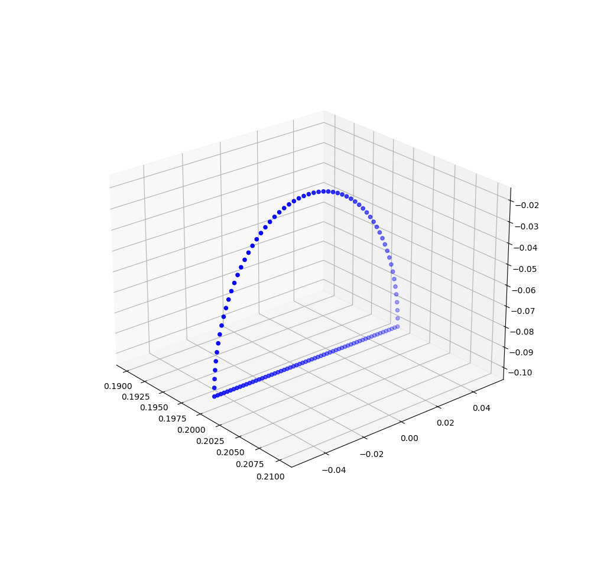

# Integration guide
## Test trajectory with different discretization frequencies
### Discrete trajectory sampled with f=5Hz

### Discrete trajectory sampled with f=10Hz

### Discrete trajectory sampled with f=20Hz

### Discrete trajectory sampled with f=100Hz
